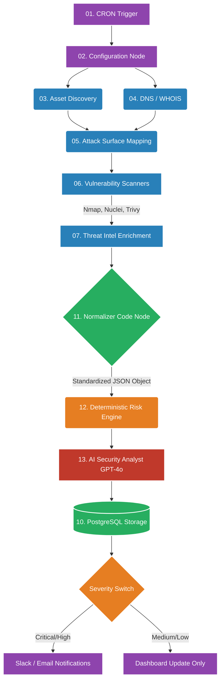
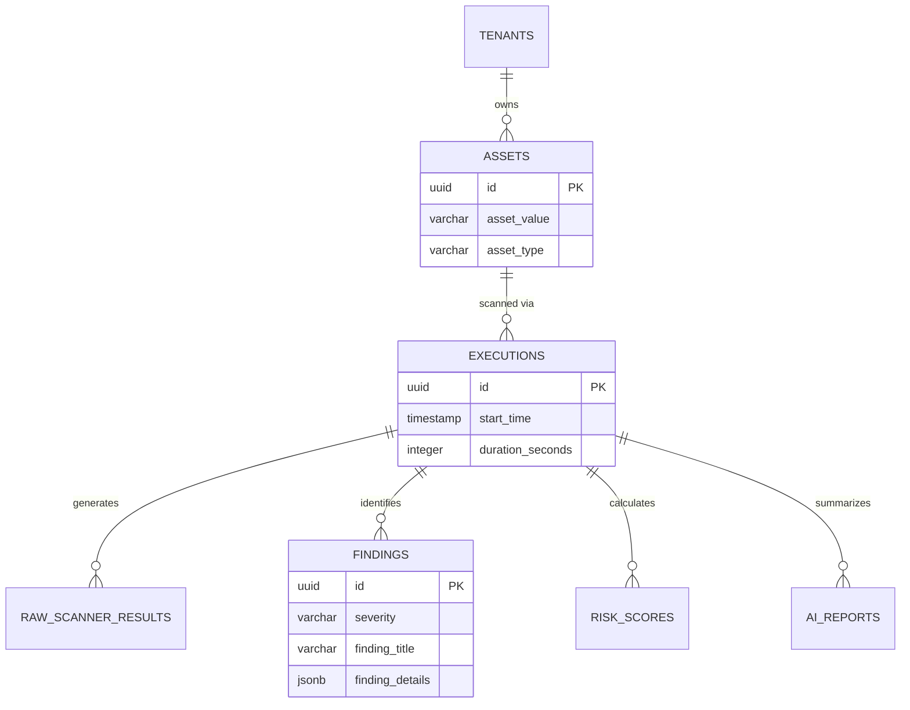

<div align="center">
  
  
  <br/>
  
  # 🛡️ AI Security Guardian
  **Enterprise-grade AI-powered Security Operations Center (SOC) built with n8n.**
  
  [](LICENSE)
  [](https://n8n.io/)
  [](https://openai.com/)
  [](https://www.postgresql.org/)
  [](https://www.docker.com/)
  [](#)
  [](https://github.com/RishvinReddy)
</div>

---

## ⚠️ Important Disclaimer
* This workflow is intended **only** for systems and assets you own or are explicitly authorized to assess.
* Scanners (such as Nmap, Nuclei, or ZAP) perform active security testing and should not be used against third-party systems without permission.
* Users are responsible for configuring API keys and credentials securely (via n8n credentials and environment variables, not hardcoded values).

---

## 📖 Overview

**AI Security Guardian** is a highly scalable, autonomous security automation platform. It transforms standard vulnerability scanning into a continuous, intelligent pipeline. 

By unifying open-source security tools (Nmap, Nuclei, Subfinder) with a deterministic Risk Engine and an OpenAI-powered Security Analyst, this project automatically discovers assets, scans for vulnerabilities, normalizes the data into a centralized JSON object, calculates risk, and delivers actionable, severity-routed alerts.

---

## 🌟 Key Features

✔ **Automated Asset Discovery**: Passively maps attack surfaces using DNS, WHOIS, and Subfinder.
✔ **Deep Vulnerability Scanning**: Executes Nmap, Nuclei, and HTTPX in parallel.
✔ **Threat Intelligence Enrichment**: Correlates findings with VirusTotal, Shodan, and EPSS scores.
✔ **Centralized Data Normalization**: Consolidates disparate tool outputs into a strict, unified JSON schema.
✔ **Deterministic Risk Engine**: Calculates risk (0-100) mathematically using CVSS, open ports, and SSL exposure.
✔ **AI Security Analyst**: GPT-4o synthesizes the raw data to provide Executive Summaries, Technical Analysis, and Business Impact statements.
✔ **Severity-Based Routing**: Automatically routes Critical alerts to Slack/WhatsApp while logging Low severities to the database.
✔ **PostgreSQL Evidence Vault**: Preserves all executions, raw scanner outputs, and AI reports in a 6-table schema.

---

## 🏗️ Architecture Pipeline

The system is deployed as a massive, single-file 150+ node n8n Mega-Workflow. The pipeline cascades through 15 logical sections.



---

## 🧩 The 15 Workflow Sections

The Mega-Workflow (`AI_Security_Guardian_Mega.json`) is visually structured into color-coded sections using n8n Sticky Notes:

1. **Trigger & Configuration**: Initializes the target domain, feature flags (`ENABLE_NMAP`, `ENABLE_AI`), and scan profiles.
2. **Asset Discovery**: Gathers subdomains using Subfinder and Amass.
3. **DNS**: Pulls A, MX, TXT, and CNAME records via Cloudflare DNS over HTTPS.
4. **Attack Surface**: Scans ports (Nmap), validates SSL chains, and extracts HTTP Security Headers.
5. **Vulnerability Scanning**: Executes fast, template-based CVE scanning using Nuclei and Trivy.
6. **Threat Intelligence**: Validates IPs against VirusTotal and Shodan.
7. **Secret Detection**: Scans repositories for exposed keys using GitLeaks.
8. **Cloud Security**: *(Phase 2 Expansion)*
9. **Log Analysis**: *(Phase 2 Expansion)*
10. **Normalizer**: The central nervous system. It compiles all outputs into a single JSON object.
11. **Historical Comparison**: Compares the current scan to the previous scan to detect delta changes (new ports, resolved CVEs).
12. **Risk Engine**: Calculates a deterministic `risk.score` out of 100 based on CVSS weights and asset exposure.
13. **AI Analyst**: Formats the findings into a strict JSON prompt, asking GPT-4o for strategic remediation advice.
14. **Reporting**: Generates Markdown and PDF execution summaries.
15. **Dashboard & Notifications**: Logs the final execution to Postgres and routes alerts based on severity.

---

## 🗄️ PostgreSQL Data Model

The platform uses a robust 6-table schema designed for long-term trend analysis and Mean-Time-To-Remediate (MTTR) tracking.



---

## 🤖 The AI Security Analyst

The workflow ensures that AI is used for **interpretation**, not calculation. 
The deterministic Risk Engine calculates the math, and the OpenAI node is provided with a strict JSON instruction set to produce actionable intelligence:

```json
{
  "summary": "Executive overview of the scan results.",
  "priority": "Immediate actions required.",
  "business_impact": "How these vulnerabilities affect compliance and revenue.",
  "technical_analysis": "Root cause analysis for engineering teams.",
  "recommendations": ["Step 1", "Step 2"]
}
```

---

## 🚀 Installation & Deployment

Deploying the AI Security Guardian is completely containerized.

### 1. Requirements
* Docker & Docker Compose
* n8n Instance
* API Keys for OpenAI, VirusTotal (Optional)
* Locally installed CLI tools (Nmap, Nuclei) if using local execution nodes.

### 2. Quick Start
```bash
# Clone the repository
git clone https://github.com/RishvinReddy/AI-Security-Guardian.git
cd AI-Security-Guardian

# Setup Environment Variables
cp .env.example .env

# Deploy the Infrastructure (n8n, Postgres, Redis)
chmod +x scripts/install-tools.sh
./scripts/install-tools.sh
docker-compose up -d
```

### 3. Import the Workflow
1. Open n8n at `http://localhost:5678`
2. Navigate to **Workflows > Import from File**
3. Select `AI_Security_Guardian_Mega.json` from the repository root.
4. Add your Credentials (OpenAI, PostgreSQL) in the n8n UI.
5. Click **Execute Workflow**!

---

## 🗺️ Roadmap

### Phase 1: Core Scanner & AI Analysis ✅ (v1.0.0)
- [x] Massive 15-Section n8n Mega Workflow
- [x] Deterministic Risk Engine + OpenAI JSON outputs
- [x] PostgreSQL 6-Table Storage Schema
- [x] YAML-based generator for architectural compilation

### Phase 2: Intelligence & Trends 🚧 (In Progress)
- [ ] Historical Comparison (Detecting closed/new ports)
- [ ] Threat Intel Aggregation & Database Caching
- [ ] Dashboards (Grafana / Metabase integration)

### Phase 3: SOC Automation 📅 (Planned)
- [ ] Jira / GitHub Issues Ticketing Automation
- [ ] Cloud & Container Security Audits (Prowler / Trivy)
- [ ] Automated Compliance Scoring (SOC2 / CIS)

---

## 🤝 Contributing
Contributions, issues, and feature requests are welcome! 
If you are modifying the architecture, please do not edit `AI_Security_Guardian_Mega.json` directly. Instead, modify `generator/workflow-spec.yaml` and re-compile using `python3 generator/build.py`.

Please review our [Contributing Guidelines](CONTRIBUTING.md) and [Code of Conduct](CODE_OF_CONDUCT.md).

---

**AI Security Guardian** is proudly engineered and maintained by [Rishvin Reddy](https://github.com/RishvinReddy).
