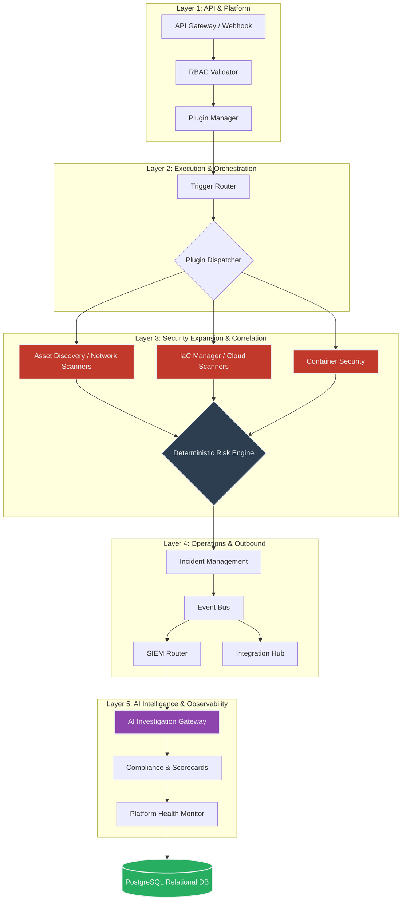

<div align="center">
  
  
  <br/>
  <br/>
  
  # 🛡️ AI Security Guardian
  **The Autonomous, Enterprise-Grade AI Security Operations Center (SOC) built on n8n.**
  
  [](LICENSE)
  [](https://n8n.io/)
  [](https://openai.com/)
  [](https://www.postgresql.org/)
  [](https://www.docker.com/)
  [](#)
  [](https://github.com/RishvinReddy)
</div>

---

## ⚠️ Important Security Disclaimer
> [!WARNING]
> This automated workflow performs **active security testing** (including port scanning and vulnerability probing). 
> **You must ONLY run this software against domains, IP addresses, and assets that you own or are explicitly authorized to test.** Unauthorized scanning of third-party infrastructure is illegal and strictly prohibited. The maintainers assume no liability for misuse.

---

## 📖 Executive Overview

**AI Security Guardian v3.0.0** represents a paradigm shift in security automation. Originally designed as a vulnerability scanning workflow, it has rapidly evolved into a complete, event-driven, autonomous Security Operations Center (SOC) platform.

By unifying open-source security tooling (Nmap, Nuclei, Trivy, Prowler) with a strict API Gateway, dynamic Plugin Managers, and a deterministic Risk Engine, the platform ingests massive amounts of raw telemetry. It then leverages a multi-agent AI framework (powered by GPT-4o) to execute deep security investigations, routing normalized incidents out to enterprise SIEMs via an internal Event Bus.

### 📊 Platform Statistics (v3.0.0)
- **~700** Workflow Nodes
- **18** Logical Execution Sub-Engines
- **35** Normalized PostgreSQL Tables
- **Multi-Agent AI** (Incident Commander, Threat Analyst, Compliance Analyst, Executive)
- **100%** Open Source Architecture

### 📸 Screenshots
*(Coming soon)*
- **SOC Dashboard**: `assets/soc-dashboard.png`
- **AI Investigation Chat**: `assets/ai-investigation.png`
- **SIEM Event Payload**: `assets/siem-payload.png`

---

## 🏗️ Core Architecture (v3.0.0)

The ecosystem is divided into 5 distinct architectural layers, ensuring maximum scalability, fault tolerance, and modularity.



---

## ⚙️ Deep Dive: The 5 Layers of Security Orchestration

### Layer 1: Platform Foundation (API & RBAC)
Unlike traditional n8n workflows that rely on cron triggers, AI Security Guardian exposes a native **API Gateway** (`/scan`, `/investigation`, `/dashboard`). 
Every inbound request hits the **RBAC Validator**, cross-referencing the request token against the `roles` and `permissions` tables in PostgreSQL. If an Analyst requests a scan on a highly restricted production tenant without authorization, the workflow halts with a `401 Unauthorized`.

### Layer 2: Plugin-Driven Execution
Hardcoded scanners are obsolete. Layer 2 queries the `plugins` table in PostgreSQL to dynamically determine which tools to run. 
If `Nuclei` is disabled in the DB, the **Plugin Manager** gracefully bypasses that branch at runtime, drastically improving performance and allowing instant toggle-ability via UI/API without modifying the workflow YAML.

### Layer 3: Security Expansion & Deterministic Risk
The platform does not rely on AI to guess risk. 
Data from Network Scanners, Container Audits (Trivy), Cloud Posture (Prowler), and IaC Manifests (Terraform/Helm) all funnel into a single **Data Normalizer**. This normalized schema is fed into the **Deterministic Risk Engine**, a math-based script that assigns hard multipliers. 
> [!NOTE]
> Example: An IaC finding for an `aws_security_group` exposing `0.0.0.0/0 on port 22` immediately inflates the baseline risk score by `+15` points before the infrastructure is even deployed.

### Layer 4: Operations & The Event Bus
Once an incident is verified, it hits the **Event Bus**. The workflow injects tracking UUIDs (`correlation_id`, `tenant_id`) and fans out the payload. 
The **Integration Hub** routes messages to Slack/Jira/ServiceNow, while the **SIEM Router** normalizes the exact same payload for Splunk, Elastic, and Microsoft Sentinel.

### Layer 5: AI Intelligence & Observability
**The AI Investigation Gateway** acts as the crown jewel. You can send a request to `/investigation` asking: *"Why is Incident #241 critical?"*
1. **Context Builder**: Dips into PostgreSQL and pulls all historical findings, cloud posture, and related tickets.
2. **Intent Detector**: Routes the prompt to one of four sub-agents: *Threat Analysis*, *Compliance Check*, *Executive Summary*, or *Incident Breakdown*.
3. **Observability**: The workflow natively tracks AI token costs, API latency, and DB queue depths, generating internal `workflow_health_incidents` if degradation is detected.

---

## 🗄️ Database Schema: The Nervous System

The massive 35-table PostgreSQL schema is designed for multi-tenant, enterprise auditing. 

| Logical Group | Key Tables | Purpose |
| :--- | :--- | :--- |
| **Assets & CMDB** | `assets`, `executions`, `raw_scanner_results` | Tracks domains, owners, and raw execution logs. |
| **Findings & Risk** | `findings`, `risk_scores`, `ai_reports` | Normalized security telemetry and calculated scores. |
| **Expansion Layers** | `cloud_findings`, `container_findings`, `iac_findings` | Niche security domain data tracking. |
| **Access Control** | `roles`, `users`, `permissions`, `api_keys` | Complete RBAC backend for the API Gateway. |
| **Plugins** | `plugins`, `plugin_settings`, `plugin_logs` | Dynamic scanner configurations and credential vaults. |
| **Operations** | `incidents`, `tickets`, `platform_events`, `ai_metrics` | Event bus routing, SIEM integration, and token auditing. |

---

## 🧪 Demo Data & Workflow Exports
If you want to test the platform without running active scans, check the `examples/` folder. It contains:
- `demo-config.json` - Safe, non-invasive scan configurations.
- `mock_incidents.json` - Sample Risk Engine outputs for AI testing.
- `sample_siem_payload.json` - What the Event Bus sends to Splunk/Sentinel.

---

## 🚀 Installation & Deployment

Deploying the AI Security Guardian is completely containerized.

### 1. Requirements
* Docker & Docker Compose
* n8n Instance (Included in `docker-compose.yml`)
* API Keys for OpenAI

### 2. Quick Start
```bash
# Clone the repository
git clone https://github.com/RishvinReddy/AI-Security-Guardian.git
cd AI-Security-Guardian

# Setup Environment Variables
cp .env.example .env

# Deploy the Infrastructure (n8n, Postgres, Redis)
docker-compose up -d
```

### 3. Import the Mega-Workflow
1. Open n8n at `http://localhost:5678`
2. Navigate to **Workflows > Import from File**
3. Select `AI_Security_Guardian_Mega.json` from the repository root.
4. Execute `node generator/seed_db.js` (Optional: Seeds DB plugins).
5. Click **Execute Workflow**!

---

## 📁 Repository Structure
```text
ai-security-guardian/
├── AI_Security_Guardian_Mega.json # The compiled ~700 node platform
├── generator/                     # YAML-to-JSON compiler logic
│   ├── workflow-spec.yaml         # Edit architecture here!
│   ├── build.py                   # Compiler script
│   └── scripts/                   # Migration scripts
├── database/
│   └── init.sql                   # 35-Table PostgreSQL schema
├── docs/                          # Detailed architecture documentation
│   └── configuration.md
├── VALIDATION.md                  # Verification suite instructions
└── CHANGELOG.md                   # Release notes
```

---

## 🗺️ Roadmap & Phase 5 (Enterprise SaaS)

While Phase 4 finalized the core workflow node count, Phase 5 aims to convert the system into an Enterprise SaaS architecture:
- **Module 1 (Multi-Tenant SaaS)**: Complete tenant isolation, user invitations, and billing hooks.
- **Module 2 (Distributed Scanning)**: Remote regional agents executing scan queues to balance load.
- **Module 3 (Attack Path Analysis)**: Correlating isolated findings into graph-based kill chains.
- **Module 4 (Autonomous Response)**: Configurable responses like disabling exposed services or generating IaC PRs.

---

## 🤝 Contributing
Contributions, issues, and feature requests are highly encouraged! 

**IMPORTANT:** Because the `AI_Security_Guardian_Mega.json` is a massive ~700 node file, manual pull requests altering the JSON directly are nearly impossible to review. 
If you are modifying the workflow architecture, you **must** edit `generator/workflow-spec.yaml` and re-compile the JSON using `python3 generator/build.py`.

Please review our [Contributing Guidelines](CONTRIBUTING.md) and [Code of Conduct](CODE_OF_CONDUCT.md).

---

<div align="center">
  <b>AI Security Guardian</b> is proudly engineered and maintained by <a href="https://github.com/RishvinReddy">Rishvin Reddy</a>.
</div>
