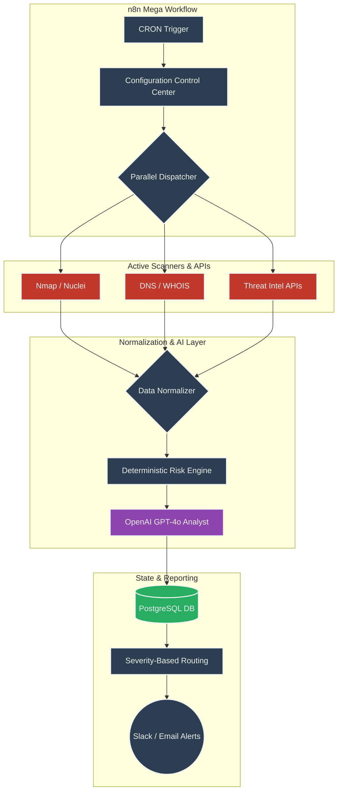
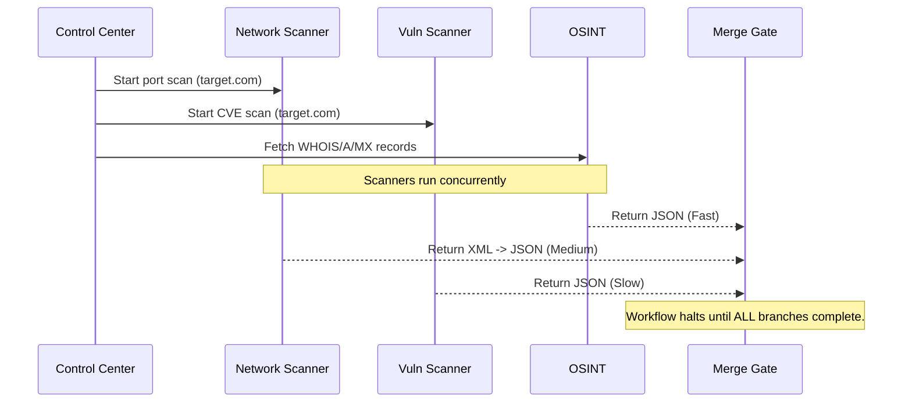
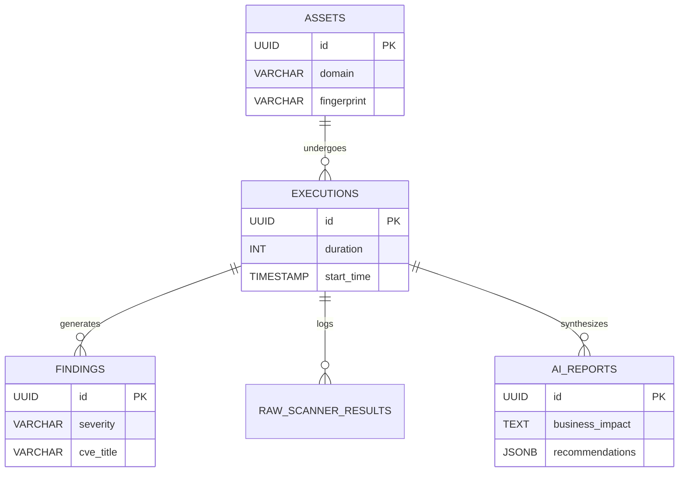

<div align="center">
  
  
  <br/>
  <br/>
  
  # 🛡️ AI Security Guardian
  **The Autonomous, Enterprise-Grade AI Security Operations Center (SOC) built on n8n.**
  
  [](LICENSE)
  [](https://n8n.io/)
  [](https://openai.com/)
  [](https://www.postgresql.org/)
  [](https://www.docker.com/)
  [](#)
  [](https://github.com/RishvinReddy)
</div>

---

## ⚠️ Important Security Disclaimer
> This automated workflow performs **active security testing** (including port scanning and vulnerability probing via Nmap, Nuclei, Trivy, etc.). 
> **You must ONLY run this software against domains, IP addresses, and assets that you own or are explicitly authorized to test.** Unauthorized scanning of third-party infrastructure is illegal and strictly prohibited. The maintainers assume no liability for misuse.

---

## 📖 Executive Overview

**AI Security Guardian** is a highly scalable, fully autonomous security automation platform. It bridges the gap between traditional raw vulnerability scanners and modern, context-aware Security Operations Centers. 

Instead of relying on human analysts to parse thousands of lines of Nmap XML or Nuclei JSON, this platform orchestrates the tools, mathematical calculates the exact deterministic risk based on exposure, and leverages **GPT-4o** to act as a Senior Security Analyst—synthesizing the data into prioritized, executive-ready intelligence.

---

## 🏗️ High-Level System Architecture

The ecosystem relies on three primary pillars: **Orchestration** (n8n), **Execution** (Security Scanners), and **State Management** (PostgreSQL).



---

## ⚙️ How It Works: Inputs, Processing, and Data Flow

The workflow is compiled as a **150+ node Mega-Workflow**. Below is the deep dive into exactly how data traverses the system.

### 1. Triggering & Inputs (How it Starts)
The workflow is designed to be completely autonomous. It triggers in two ways:
1. **CRON Scheduler**: Wakes up at a defined interval (e.g., daily at 2 AM).
2. **Manual Execution**: Triggered via the n8n UI for ad-hoc assessments.

The first node it hits is the **`CFG_Configuration`** Control Center. This is where all dynamic variables are initialized and injected into the pipeline:
```json
{
  "TARGET_DOMAIN": "example.com",
  "SCAN_PROFILE": "Deep",
  "ENABLE_NMAP": true,
  "ENABLE_NUCLEI": true,
  "TIMEOUT": 60
}
```

### 2. Parallel Processing (How we execute)
Because security scans are time-consuming, the workflow uses n8n's asynchronous execution to fan out the workload. 
The configuration variables are passed downstream simultaneously to all enabled Collector Nodes.



### 3. The Normalization Engine (How we structure chaotic data)
Raw outputs from security tools are notoriously messy. Nmap returns XML, Nuclei returns multi-line JSON objects, and WHOIS returns plain text.
The **`CODE_StandardizeJSON`** node acts as a funnel. It intercepts all raw data, cleans it, and maps it to our strict Global Data Object schema.

**The Global Data Object Structure:**
```json
{
  "workflow_metadata": { "execution_id": "uuid-1234", "version": "1.0.0" },
  "asset": { "domain": "example.com", "fingerprint": "example.com_1.1.1.1" },
  "dns": { "records": [] },
  "ports": [ { "port": 80, "state": "open" } ],
  "vulnerabilities": [ { "id": "CVE-2024-XXXX", "severity": "high" } ],
  "risk": { "score": null },
  "execution": { "duration": 145, "scanners_failed": 0 }
}
```

### 4. Deterministic Risk Engine (How we calculate danger)
We **do not** let AI guess the risk score. AI is prone to hallucination. Instead, we use a deterministic math engine written in standard JavaScript.

```mermaid
flowchart LR
    A[Vulnerabilities Found] -->|+40 points per Critical| D(Total Score)
    B[Exposed RDP/SSH Ports] -->|+15 points per Port| D
    C[Missing HTTP Headers] -->|+5 points per Header| D
    
    D --> E{Math.min(Score, 100)}
    E --> F[Final Risk Score 0-100]
```

### 5. AI Security Analyst (How we synthesize)
Once the math is done, the complete Global Data Object (including the deterministic Risk Score) is passed to **OpenAI (GPT-4o)**. 
We utilize a strict System Prompt forcing the LLM to output a machine-readable JSON summary, rather than a conversational wall of text.

**The AI Prompt:**
> *You are a Senior Security Analyst. Analyze the provided DNS, Port, Vulnerability, and Risk Score data. Output a JSON object containing an `executive_summary`, `technical_analysis`, `business_impact`, and a prioritized array of `recommendations`.*

### 6. Multi-Table Relational Logging (How we track history)
Before any alerts are sent, all evidence is permanently preserved in PostgreSQL. We use a 6-table normalized schema, ensuring we can track metrics like MTTR (Mean Time to Remediate) over time.



### 7. Severity-Based Alerting (How we notify)
To prevent "alert fatigue", the workflow uses a Switch Node to inspect the final Risk Score and route notifications appropriately.

| Risk Score | Severity Level | Action Taken |
| :--- | :--- | :--- |
| **90 - 100** | CRITICAL | Instant Slack Message + Email + High-Priority DB Flag |
| **70 - 89** | HIGH | Slack Message + Database Logging |
| **40 - 69** | MEDIUM | Email Digest + Database Logging |
| **10 - 39** | LOW | Database Logging Only (Dashboard visibility) |
| **0 - 9** | INFORMATIONAL | Database Logging Only |

---

## 🛠️ Complete Feature Matrix

| Category | Capability | Status |
| :--- | :--- | :--- |
| **Reconnaissance** | DNS Mapping, WHOIS, Reverse DNS, Subfinder | ✅ Active |
| **Attack Surface** | Nmap Port Scanning, SSL Expiry & Cipher Validation, HTTP Security Headers | ✅ Active |
| **Vulnerability** | Nuclei Template Scanning, Trivy Image/FS Scanning | ✅ Active |
| **Threat Intel** | VirusTotal IP Reputation, Shodan Exposure, EPSS Exploitation Probabilities | ✅ Active |
| **AI Operations** | GPT-4o Executive Summarization, Technical Root Cause Analysis, Remediation Steps | ✅ Active |
| **Orchestration** | Parallel Execution, `continueOnFail` fault tolerance, Error catch pipelines | ✅ Active |
| **Data Storage** | PostgreSQL Relational schema, Raw JSONB evidence vaults | ✅ Active |

---

## 🚀 Installation & Deployment

Deploying the AI Security Guardian is completely containerized.

### 1. Requirements
* Docker & Docker Compose
* n8n Instance (Included in `docker-compose.yml`)
* API Keys for OpenAI, VirusTotal (Optional)
* Locally installed CLI tools (Nmap, Nuclei) if using local execution nodes.

### 2. Quick Start
```bash
# Clone the repository
git clone https://github.com/RishvinReddy/AI-Security-Guardian.git
cd AI-Security-Guardian

# Setup Environment Variables
cp .env.example .env

# Deploy the Infrastructure (n8n, Postgres, Redis)
chmod +x scripts/install-tools.sh
./scripts/install-tools.sh
docker-compose up -d
```

### 3. Import the Mega-Workflow
1. Open n8n at `http://localhost:5678`
2. Navigate to **Workflows > Import from File**
3. Select `AI_Security_Guardian_Mega.json` from the repository root.
4. Add your Credentials (OpenAI, PostgreSQL) in the n8n UI.
5. Click **Execute Workflow**!

---

## 🗺️ Roadmap

### Phase 1: Core Scanner & AI Analysis ✅ (v1.0.0)
- [x] Massive 15-Section n8n Mega Workflow
- [x] Deterministic Risk Engine + OpenAI JSON outputs
- [x] PostgreSQL 6-Table Storage Schema
- [x] YAML-based generator for architectural compilation

### Phase 2: Intelligence & Trends 🚧 (In Progress - v1.1.0)
- [ ] Historical Comparison (Detecting closed/new ports via SQL diffs)
- [ ] Threat Intel Aggregation & Database Caching (`threat_intel_cache` table)
- [ ] Executive Dashboards (Grafana / Metabase integration)

### Phase 3: SOC Automation 📅 (Planned)
- [ ] Jira / GitHub Issues Ticketing Automation based on findings
- [ ] Cloud & Container Security Audits (Prowler / Trivy integration)
- [ ] Automated Compliance Scoring (SOC2 / CIS Benchmarks)

---

## 🤝 Contributing
Contributions, issues, and feature requests are highly encouraged! 

**IMPORTANT:** Because the `AI_Security_Guardian_Mega.json` is a massive 150+ node file, manual pull requests altering the JSON directly are nearly impossible to review. 
If you are modifying the workflow architecture, you **must** edit `generator/workflow-spec.yaml` and re-compile the JSON using `python3 generator/build.py`.

Please review our [Contributing Guidelines](CONTRIBUTING.md) and [Code of Conduct](CODE_OF_CONDUCT.md).

---

<div align="center">
  <b>AI Security Guardian</b> is proudly engineered and maintained by <a href="https://github.com/RishvinReddy">Rishvin Reddy</a>.
</div>
