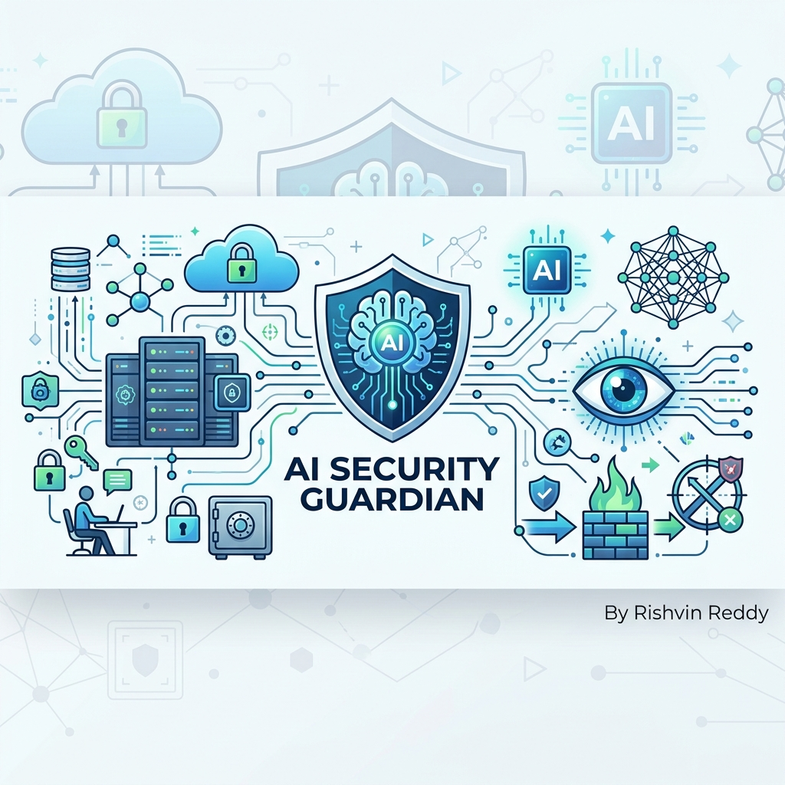

<div align="center">
  
  
  # AI Security Guardian
  *Enterprise-grade AI-powered Security Operations Center built with n8n.*
  
  [](LICENSE)
  [](https://n8n.io/)
  [](https://openai.com/)
  [](https://www.postgresql.org/)
  [](https://www.docker.com/)
  [](#)
</div>

---

## ⚠️ Important Disclaimer
* This workflow is intended **only** for systems and assets you own or are explicitly authorized to assess.
* Some scanners (such as Nmap, Nuclei, or ZAP) perform active security testing and should not be used against third-party systems without permission.
* Users are responsible for configuring API keys and credentials securely (via n8n credentials and environment variables, not hardcoded values).

---

## 🌟 Features
✔ **Attack Surface Monitoring** (DNS, WHOIS, Subfinder, Nmap, Headers)
✔ **Vulnerability Scanning** (Nuclei, Trivy)
✔ **Threat Intelligence** (VirusTotal, Shodan, EPSS)
✔ **Deterministic Risk Scoring** (CVSS + Asset Exposure correlation)
✔ **AI Risk Analysis** (Automated Executive & Technical Summaries via GPT-4o)
✔ **Automated Reporting & Notifications** (Slack, Email)
✔ **PostgreSQL Logging** (6-Table schema for historical analysis)
✔ **Docker Deployment** (Full stack orchestration)

## 🏗️ Architecture

AI Security Guardian operates as a single massive 15-section pipeline, automatically compiled from a YAML generator.

1. **Trigger & Configuration**: Defines Target, Scan Profiles, and Feature Flags.
2. **Collectors**: Discover assets and scan for vulnerabilities in parallel.
3. **Normalizer**: Centralizes all outputs into a single JSON object with metadata, execution metrics, and fingerprints.
4. **Intelligence & Risk**: Queries external APIs and calculates deterministic risk.
5. **AI Analyst**: GPT-4o reviews the findings and outputs strict JSON recommendations.
6. **Reporting**: Database preservation and severity-based notification routing.

## 🚀 Installation

1. **Clone the repository:**
   ```bash
   git clone https://github.com/RishvinReddy/AI-Security-Guardian.git
   cd AI-Security-Guardian
   ```

2. **Configure Environment:**
   ```bash
   cp .env.example .env
   # Edit .env with your secrets
   ```

3. **Deploy the Stack:**
   ```bash
   docker-compose up -d
   ```

4. **Import the Workflow:**
   - Access n8n at `http://localhost:5678`
   - Go to **Workflows -> Import from File**
   - Select `AI_Security_Guardian_Mega.json`

## 🗺️ Roadmap

- **Phase 1: Core Scanner & AI Analysis** ✅ (v1.0.0)
- **Phase 2: Historical Comparison & Threat Intel Enrichment** 🚧 (Planned)
- **Phase 3: Cloud Security & Ticket Automation** 📅 (Future)

## 🤝 Contributing
Contributions, issues, and feature requests are welcome! Feel free to check the [issues page](../../issues). Read the [CONTRIBUTING.md](CONTRIBUTING.md) for details.

---

**AI Security Guardian** is maintained by [Rishvin Reddy](https://github.com/RishvinReddy).
